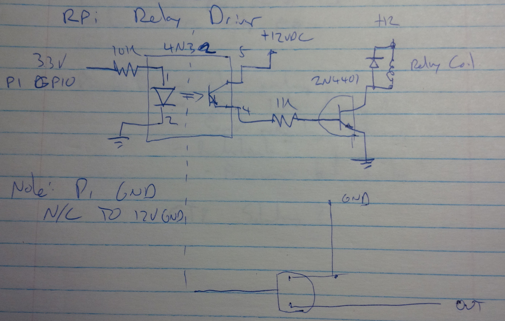

# Using GPIO on the Raspberry Pi

- The Internet of Things is all about devices connected to physical systems.  
- To start with, we'll need to connect to the things!  
- Raspberry Pi is a great little computing platform.
  - Might be a little expensive for production use, but given the software
  transferability, you could prototype with a Pi and then move to something like
  the Onion Omega, FriendlyARM, etc.
- Raspberry Pi includes a 40-pin GPIO Connector
  - What is this?

# What we Need to Know

- Functional  
- Mechanical  
- Electrical  
- Programming API  

# Functional Interface

GPIO = "General Purpose Input/Output"

- At its simplest, digital I/O  
  - Inputs and Outputs  
  - On/Off, 0/1, High/Low  
- One of the challenges of chip design is that connections to the outside take
a _lot_ more space than transistors...  
- So, pins often have more than one possible function

  
http://pinout.xyz

- UART: Universal Asynchronous Receiver/Transmitter  
  - aka Serial Port  
- I2C: Inter-Integrated Circuit Bus  
- SPI: Serial Peripheral Interface  
- PWM: Pulse Width Modulation  
- GCLK: Outputs a fixed frequency
- 5V, 3V3: 5VDC and 3.3VDC power pins  
- Pins shown in black are Ground  

## Lesser-Used Functions

- DPI: Display Parallel Interface  
 - You can add a VGA port with a bunch of resistors  
- JTAG: Debug interface for the chip - Used for manufacturing test  
- PCM: Digital Audio  

## We'll Take a Look At

- GPIO - buttons and lights  
- I2C - because this can be used to talk to Arduino!

# Mechanical Interface  

- 40-pin Header  
- Connector and flat cables are readily available  
  - Sayal or Digikey  

## Experimental Adapter

For convenience of experimenting, you might want to pick up one of these:
- Adafruit Pi T-Cobbler  
- US$ 7.95  
- Connects the pins to a solderless breadboard

# Electrical Interface

- Basic Information  
  - voltages and current limits  
- Digital Inputs  
  - Switches  
  - Optocoupled Input  
- Digital Outputs  
  - LED  
  - Transistor Output  
    - Relay
  - Optocoupled Output
    - Optocoupled Transistor Output  
    - Relay Driver  

## Basic Information

- All I/O is at 3.3V  
    - Don't connect a GPIO to anything higher than 3.3V  
    - Well... it's probably OK through a resistor, as for an LED.  
- 5VDC is available on the connector  
- Info on source/sink capabilities is kind of hard to find  
    - Default setup is 8mA source/sink per pin  
    - But that's really more than the 3.3V PSU can do  
    - For safety, let's assume 2mA  
    - Source current for all pins < 50mA  
- You can provide +5VDC to the Pi on Pins 2 and 4  
- 3.3V is generated on-board.  

## Digital Input

- Best practice - input is closed to ground  
- Switch/button connects to gnd  
- For a machine input - NPN output on your PLC  
- If in doubt, use optocoupler

- Note: There is an internal pullup that you can turn on.

## Optocoupled Input

- No electrical connection between the Pi and the outside  
- Use whenever you're not sure about what somebody might connect.  
- Works particularly well with connections to external equipment like PLCs  

## Digital Output - Basic

- Remember, the Pi GPIO can only sink or source 2mA - 8mA
  - By comparison, Arduino: 40 mA per pin
- That's just about enough for an LED
- Series Resistor: (3.3V - 2V)/ 0.002mA = 667&#937;

## Digital Output - Transistor Driver

- If we want a little more current, we can use a Transistor  
- e.g. NPN circuit:  

## Digital Output - Optocoupled Output

- Same idea, if we're nervous about shared grounds or electrical spikes

## Digital Output - Relay Driver

# Programming

## Python API  

Import the library - it's already installed on the RPi

    import RPi.GPIO as GPIO

## Python API (cont'd)

We can refer to the pins either by board numbering or BroadCom's pin numbering

    GPIO.setmode(GPIO.BCM)

or

    GPIO.setmode(GPIO.BCM)

## Python API (cont'd)

Set the pin to be input or output:

    GPIO.setup(22, GPIO.IN, pull_up_down=GPIO.PUD_UP)
    GPIO.setup(23, GPIO.OUT)

## Python API (cont'd)

Write the output

    GPIO.output(23, GPIO.HIGH)

Or read the input

    inp=GPIO.input(22)

## Python API (cont'd)

    GPIO.cleanup()

...returns the pins to all inputs, with no pullup/pulldown

# Conclusion

The Raspberry Pi is pretty easy to connect to the outside world.
